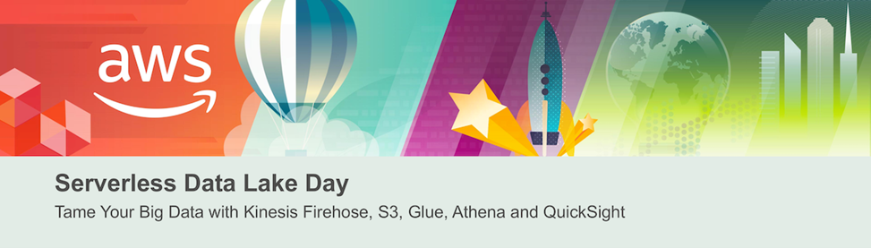
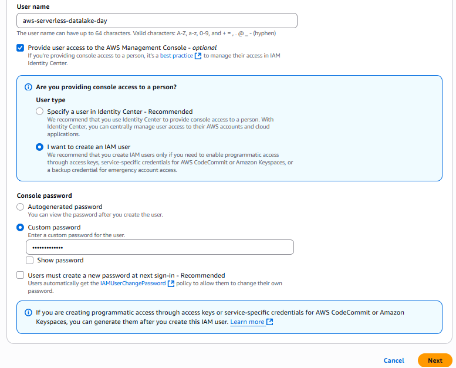
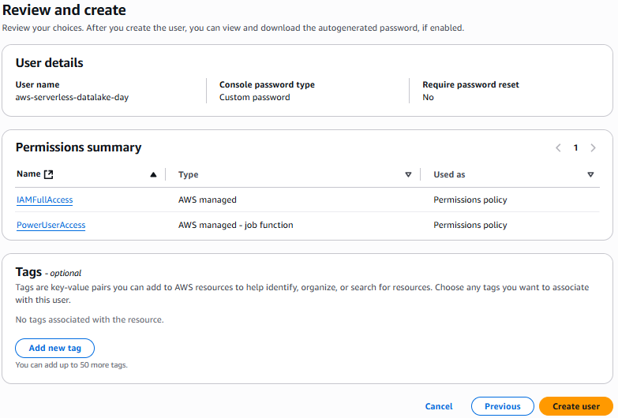
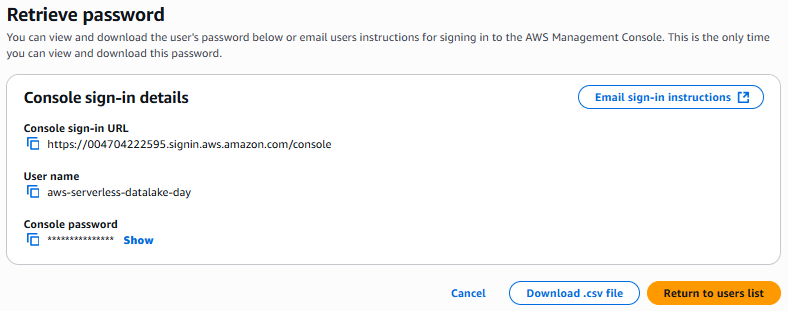
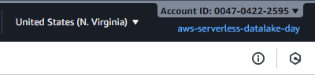
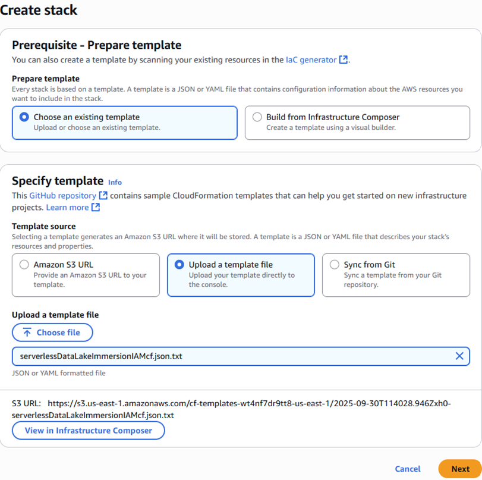
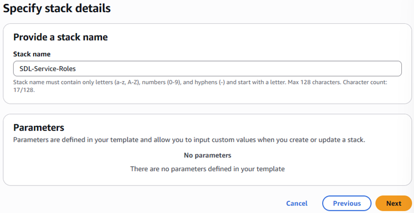
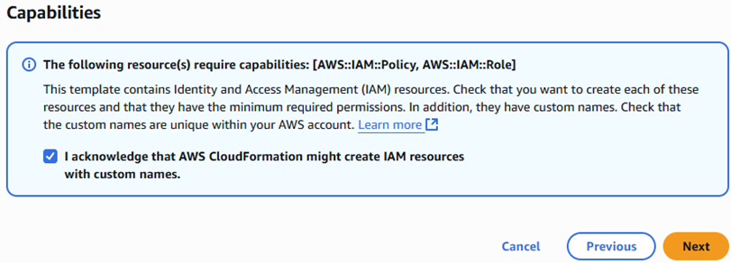
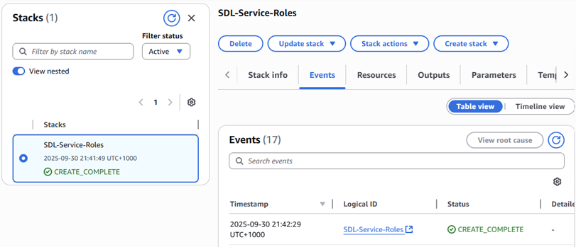

# Serverless Data Lake Day Workshop Documentation

This project documents my experience working on the Serverless Data Lake Day workshop, a hands-on introduction to building a cloud-native, serverless data lake using AWS services. As a beginner in data engineering, I focused on ingesting, cataloging, transforming, and analyzing large datasets without managing infrastructure. The workshop uses the GDELT dataset (~170GB+ of global events data) and covers AWS Glue, Kinesis, S3, Athena, and more. I opted for batch ingestion in Lab 1 for efficiency and skipped QuickSight setup in Lab 3 due to free tier limitations.



## Workshop Overview

The workshop emphasizes modern data architectures to handle explosive data growth, consolidating silos into scalable data lakes for analytics and ML. Key pillars include scalable storage, purpose-built services, unified access/governance, and cost optimization. AWS provides serverless tools for ingestion (Kinesis Firehose), ETL (Glue), storage (S3), querying (Athena), and visualization (QuickSight).

- Reviewed the solution architecture: Streaming ingestion to S3, Glue for cataloging/ETL, Athena for SQL queries, and QuickSight for dashboards.


**Key Learnings:** Modern data lakes centralize raw data in its original form, enabling flexible processing and broad access. AWS's serverless services reduce management overhead, supporting diverse patterns like batch/streaming ingestion and unified analytics across structured/unstructured data.

## Prerequisites

I prepared my AWS environment to ensure smooth execution, focusing on security and resource setup.

- Created an AWS account (or used a sandbox) and noted potential costs (~$5-10 total, mainly Athena/Glue).
- In IAM Console, created a user ("workshop") with console access, attached PowerUserAccess and IAMFullAccess policies for workshop services.









- Downloaded the CloudFormation template, launched stack "SDL-Service-Roles" to provision S3 bucket and IAM roles (e.g., SDL-GlueRole).









**Key Learnings:** IAM users with least-privilege policies (e.g., PowerUserAccess) enable safe experimentation. CloudFormation automates infrastructure like S3 buckets and roles, enforcing best practices for data lake governance and cost tagging (e.g., project: serverlessdatalake).

## Lab 1: Data Ingestion & Storage

I ingested sample GDELT data into S3 to simulate a data lake foundation, choosing batch ingestion for speed (Option 1: ~15 minutes).

### Option 1: Batch Ingestion

- Launched AWS CloudShell from the console for CLI access.


- Ran commands to copy partitioned data (2019/06/18 hours 20-21) from public S3 to my bucket:

```
export MY_ACCOUNT_ID="$(aws sts get-caller-identity --query Account --output text)"
aws s3 cp s3://kat-tame-bda-immersion/raw/2019/06/18/20/ s3://sdl-immersion-day-$MY_ACCOUNT_ID/raw/year=2019/month=06/day=18/hour=20/ --recursive
aws s3 cp s3://kat-tame-bda-immersion/raw/2019/06/18/21/ s3://sdl-immersion-day-$MY_ACCOUNT_ID/raw/year=2019/month=06/day=18/hour=21/ --recursive
text
```


- Verified data in S3 Console: Navigated to sdl-immersion-day-[account]/raw/ and confirmed folders/partitions.


**Key Learnings:** Batch ingestion via AWS CLI/S3 cp efficiently populates data lakes from sources like Systems of Record (SoR) or external datasets. Partitioning (e.g., year/month/day/hour) optimizes queries; S3's scalability handles petabyte volumes securely.

_(Note: I skipped Option 2—real-time streaming with Kinesis Data Firehose—for time constraints, but it would involve a data generator app for continuous ingestion.)_

## Lab 2: Data Cataloging and ETL

I cataloged raw data and built ETL pipelines using AWS Glue, exploring visual and interactive approaches.

### Lab 2.1: Cataloging Your Data

- In Glue Console, created crawler "sdl-demo-crawler": Added S3 data source (sdl-immersion-day-[account]/raw/), used SDL-GlueRole, output to new database "sdl-demo-data" (on-demand schedule).


- Ran the crawler (~2 minutes) and verified table "raw" under Tables, showing JSON schema, partitions, and metadata.


- Edited schema: Actions > Edit schema, renamed Partition 0-3 to year/month/day/hour, saved as new table version.


**Key Learnings:** Glue Crawlers automate schema discovery, populating the Data Catalog for queryable metadata without data movement. Tables define schemas/partitions; editing ensures Hive-compatible naming for efficient partitioning.

### Lab 2.2: Visually Transform Data with Drag-and-Drop

- Created S3 folder for scripts: In S3, added /scripts/ to sdl-immersion-day-[account]/.


- In Glue Studio, created Visual ETL job "transform-json-to-parquet": Set Glue 4.0/Python, 2 G.1X workers, script path s3://sdl-immersion-day-[account]/scripts/.


- Added nodes: Source S3 (catalog table raw), Target S3 (Parquet/Snappy, compressed-parquet/), Change Schema (drop "color", rename datesoldsince/until to date_start/until).


- Reviewed generated PySpark script in Script tab.


- Ran job, monitored in Runs tab (Starting > Running > Succeeded), verified output in S3/compressed-parquet/.


**Key Learnings:** Glue Studio's no-code interface generates scalable Spark ETL code for transformations (e.g., format conversion, field drops/renames). Serverless execution handles infrastructure; metrics aid tuning for performance/cost.

### Lab 2.3: Interactive ETL Code Development

- Uploaded Jupyter notebook "Lab 2.3 - Advanced Data Preparation.ipynb" to Glue Studio (Notebook type, SDL-GlueRole), renamed to "Advanced Data Preparation."


- In notebook: Set account ID, connected to raw S3 data via Glue DynamicFrame, inspected schema, applied transformations (e.g., filters, joins, calculated columns), partitioned output by department/date, wrote to S3/enriched/.
- Example cells: Load data, drop nulls, add derived fields, write Parquet.

  
  


- Reviewed triggers: Added a scheduled trigger (daily) for ETL jobs via Glue console.


**Key Learnings:** Interactive Sessions enable REPL-style development for complex ETL (e.g., PySpark joins/enrichments) without clusters. Notebooks integrate with IDEs; triggers automate workflows, supporting event-driven or scheduled processing.

## Lab 3: Data Analytics & Visualization

I queried the GDELT dataset with Athena for ad-hoc analysis, focusing on SQL over large-scale data.

### Lab 3.1: SQL Analytics on a Large Scale Open Dataset

- In Athena Console, set query results to s3://sdl-immersion-day-[account]/athena-results/, launched editor (Trino SQL).


- Created database: `CREATE DATABASE gdelt;`


- Created events table: `CREATE EXTERNAL TABLE gdelt.events (...) ROW FORMAT SERDE ... LOCATION 's3://gdelt-open-data/events/';`


- Uploaded dimension files (eventcodes, countries, types, groups) to S3/gdelt/[folder]/ via Console.


- Created dimension tables: e.g., `CREATE EXTERNAL TABLE gdelt.eventcodes (...) LOCATION 's3://sdl-immersion-day-[account]/gdelt/eventcodes/';` (repeat for others, skip header).


- Ran queries:
- Events per year: `SELECT year, COUNT(globaleventid) AS nb_events FROM gdelt.events GROUP BY year ORDER BY year ASC;` (~30s, 190GB scanned).


- Top 10 event categories: Join events with eventcodes, group/order by count.


- Obama events per year: Filter actor1name='BARACK OBAMA'.
- Obama/Merkel events per category: Filter/join with threshold.


**Key Learnings:** Athena enables serverless SQL on S3 data (e.g., TSV/CSV) via Glue Catalog, parallelizing queries for seconds-level results on petabytes. External tables map schemas without data duplication; joins across buckets demonstrate unified access.

### Lab 3.2: Data Visualization

- Attempted QuickSight setup: Signed up for Enterprise edition, selected region, added S3 buckets (sdl-immersion-day-[account], gdelt-open-data), set account name/email.


_(Note: Skipped further steps—dataset import, dashboard creation—as QuickSight requires a paid subscription unavailable in free tier. Estimated cost: <$10/month.)_

**Key Learnings:** QuickSight provides serverless BI for interactive dashboards from Athena/S3 sources. It scales to thousands of users with pay-per-session pricing, but setup involves global-unique naming and cross-bucket access for federated data.

## Conclusion

This workshop equipped me with a serverless data lake pipeline: Ingested GDELT data to S3, cataloged/transformed via Glue (visual/interactive ETL), and queried with Athena for rapid insights—all without servers. Cleanup: Delete CloudFormation stack, empty S3 buckets, remove IAM roles to avoid costs.

Key overall learnings: AWS analytics services enable scalable, governed data flows (batch/streaming) with minimal ops. From raw ingestion to BI, it handles exabyte-scale variety/velocity, focusing effort on value over infrastructure. Ideal for data analysts/architects building future-proof architectures.
# 250016_aws-serverless-lake-day

